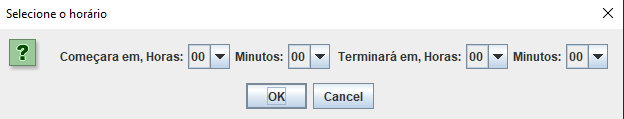
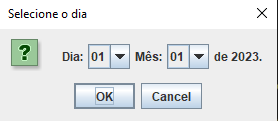

# Como funciona o código?
---
### Main.java
Primeiramente, no main java usei estes imports:
``` java
import javax.swing.*;
import classes.remota;
import classes.normal;
import classes.laboratorio;
import classes.servidor;
```
Basicamente, importei todas as classes, exceto a classe "sala", pois ela é\
abstrada, então não vou usar elas no código, apenas suas filhas.
##### Funções usadas
- JOption Pane
  Usado para criar as janelas de input, onde se atribui a uma variável o valor
  que o usuário digitou.
- JOption com array
  Basicamente se declara uma array e referencia ela no Pane. 
  
  Exemplo de criação da array:
  ``` java
  Object[] ExemploArray = {"Opção1", "Opção2", "Opção3"};
  ```
  Exemplo de implementação da array em JOption:
  ```java
  String ExemploVariavel = (String)JOptionPane.showInputDialog(
			                    null, 
			                    "Olá servidor "+Y+",\n" //Mensagem no painel
			                    + "Escolha uma sala para reservar", 
			                    "Escolha", // Mensagem do hub
			                    JOptionPane.QUESTION_MESSAGE, // tipo de painel
			                    null, // não lembro, deve ser null fds
			                    tiposdesala, //lugar da array
			                    null); // qual valor aparecerá primeiro? pode ser "Opção1", ou ExemploVariavel[0] ou só null
  ```
  
- If's:
O único if usado foi para ver qual tipo de sala o usuário quer agendar.
```java
 if (s == "Opção1") { 
 for (int l = 1; l <= 1; l++) {
 remota Opção1 = new Opção1(s, l, false, s, s, l);
 Opção1.reservar();
```
Se o valor escolhido em ` Object[] ExemploArray = {"Opção1", "Opção2", "Opção3"};` for\
igual a "Opção1", será instanciado um novo objeto: `Opção1 Variável = new Opção1(s, l, false, s, s, l);`.\
logo após, será "chamada" a função "reservar()", que será um pouco diferente em cada classe filhas, devido a polimorfismo e herança.

---
### Sala.java
Nesta classe, foram criados os atributos que serão comuns entre todas as classes. Estes sendo:
```java
public abstract class salas {
	protected String id;
	protected int capacidade;
	protected boolean tipoEvento;
	protected String responsavel;
	protected String disciplina; }
```
Os atributos estão "protegidos", pois, se estivessem "privados", não poderiam ser acessados pelas classes filhas.\
A classe é abstrata, afinal, não utilizemos ela, apenas suas filhas. Pense na classe "sala" como um "modelo".
#### Métodos
A classe sala é responsável por guardar métodos essencias, como o checksala e o reservar.
```java
public abstract void reservar();
public abstract void CheckSala(); // NÂO SERÁ USADO NA APRESENTAÇÃO de 18/05/23
```
Vale ressaltar que apenas atraves do `@Override` podemos mudar como esse método se comporta em outras classes.

### Info.java
A ideia me surgiu quando eu pensei:
> Tenho que criar tantas arrays, assim como criar um método de fazer caixas "JOption" personalizadas... \
  Isso me custará muitas linhas de código. A não ser que eu crie uma "classe" só pra isso.
Então está classe é como se fosse uma "biblioteca", onde posso apenas importar ela e usar em outras classes.
#### Funções
Está classe usa JComboBox e Jpanel, ambos fazem parte da biblioteca java e basicamente te permitem criar "JOptionPane" personalizados.
Foi através disso que consegui criar um JOptionPane para selecionar data e hora.\
##### Painel de horas:
\
###### Painel de data:
\
Não será explicado como fazer algo parecido, apenas mostrado como foi feito:
```java
 public static JPanel criarPainelHora() {
    	
        JComboBox<String> horasInicioBox = new JComboBox<>(horas);
        JComboBox<String> horasFimBox = new JComboBox<>(horas);
        JComboBox<String> minutosInicioBox = new JComboBox<>(minutos);
        JComboBox<String> minutosFimBox = new JComboBox<>(minutos);
    	 JPanel panelhoras = new JPanel();
    	 panelhoras.add(new JLabel("Começara em, Horas:"));
    	 panelhoras.add(horasInicioBox);
    	 panelhoras.add(new JLabel("Minutos:"));
    	 panelhoras.add(minutosInicioBox);   	 
    	 panelhoras.add(new JLabel("Terminará em, Horas:"));
    	 panelhoras.add(horasFimBox);
    	 panelhoras.add(new JLabel("Minutos:"));
    	 panelhoras.add(minutosFimBox);

         return panelhoras;
```
```java
 public static JPanel criarPainelData() {
    	// Cria um JComboBox para selecionar a hora
        JComboBox<String> diasBox = new JComboBox<>(dias);
        // Cria um JComboBox para selecionar os minutos
        JComboBox<String> mesesBox = new JComboBox<>(meses);

    	 JPanel paneldatas = new JPanel();
    	paneldatas.add(new JLabel("Dia:"));
    	paneldatas.add(diasBox);
    	paneldatas.add(new JLabel("Mês:"));
    	paneldatas.add(mesesBox);
    	paneldatas.add(new JLabel("de 2023."));
         return paneldatas;
```
### classes restantes (filhas)

